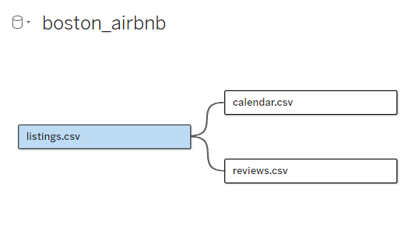
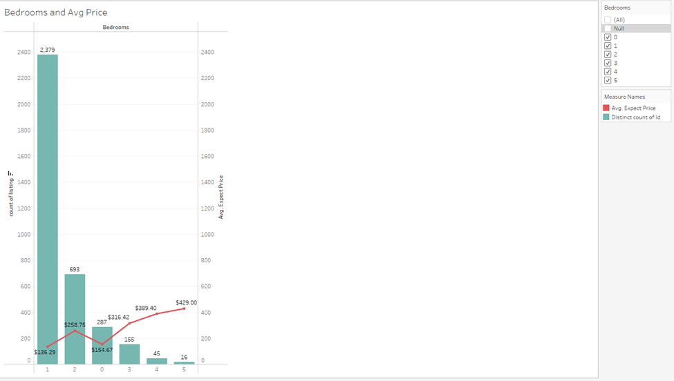
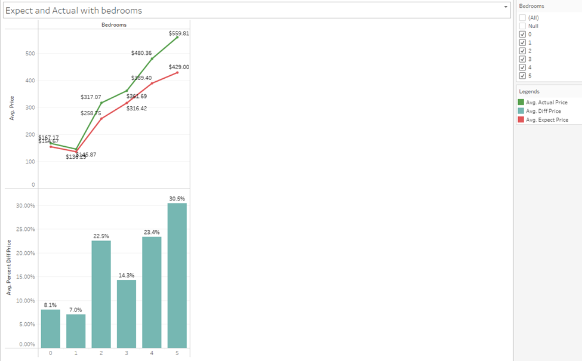
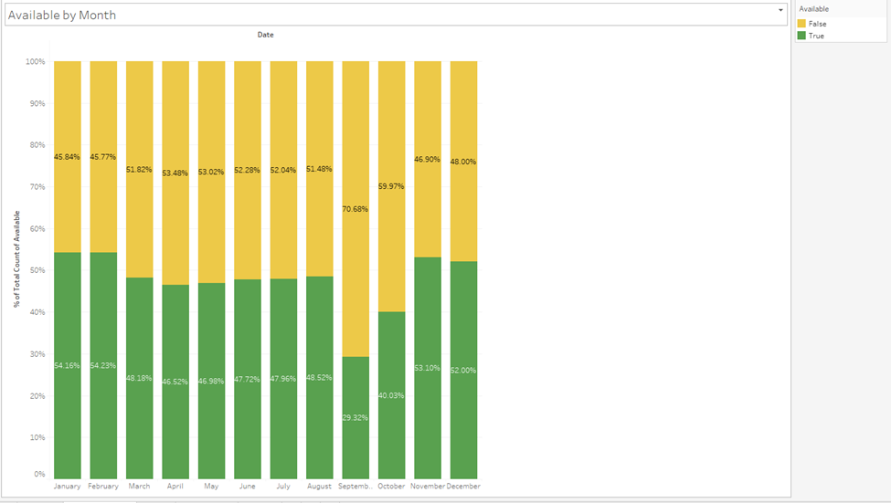
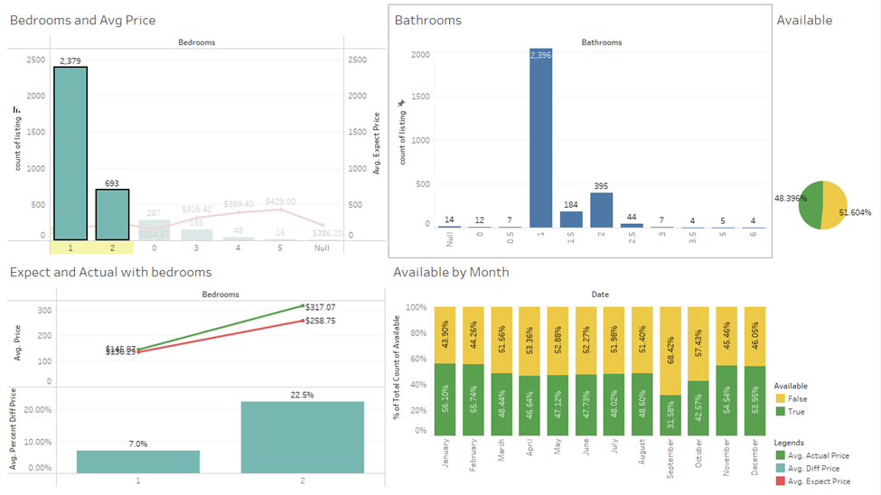

### **Introduction**
This analysis explores key trends and insights from Airbnb rental data in Boston, focusing on factors that influence rental performance and pricing strategies. Through exploratory data analysis (EDA) using Tableau Public, we aim to answer critical questions, such as the relationship between the number of bedrooms and rental prices, the gap between desired and actual prices, and seasonal variations in listing availability. By uncovering these insights, we provide practical recommendations for optimizing rental strategies on Airbnb, helping property owners and renters make data-driven decisions to maximize occupancy and revenue.

### **Boston Airbnb – Data Modeling**

For those looking to rent homes or lease them on Airbnb, determining reasonable rental prices can be challenging. Here are some key questions to address:

1. **What is the relationship between the number of bedrooms and rental prices?**
2. **How do desired prices compare with actual prices?**
3. **Which months of the year have the highest availability of listings?**

### **Question 1: What is the relationship between the number of bedrooms and rental prices?**
To answer this, we performed some preprocessing steps to exclude records without bedroom information. We then grouped the listings by the number of bedrooms, calculated their counts, and computed the average desired price for each group.

**Observations from the chart**:

* *Most registered listings are one-bedroom apartments, with an average rental price of approximately $140.*
  
* *Apartments with more than two bedrooms are generally priced higher but are less commonly listed.*
* *Two-bedroom apartments have a higher average price, around $260.*

### **Question 2: How do desired prices compare with actual prices?**

To address this, we utilized two datasets, listing and calendar, to calculate both the desired and actual prices for each listing ID. Then, we grouped the data by the number of bedrooms in each listing.

**Insights from the chart:**

* The difference between desired and actual prices is significant for five-bedroom apartments, with a gap of approximately 30%.
* For studios or one-bedroom apartments, the discrepancy is minimal.

### **Question 3: Which months of the year have the highest availability of listings?**

To answer this, we used data from calendar.csv. The data was grouped by months, and the percentage of availability values in the available column was calculated.

**Insights from the chart:**

* September and October attract the highest number of renters, with more than 59% of days being occupied.
* From November to February, rental activity is at its lowest.

### **Conclusion**

For subleasing or renting out properties on Airbnb, it is recommended to:

* Focus on one-bedroom or two-bedroom apartments, as they account for more than 52% of rented days annually.
* Set rental prices in the range of 150  to 350 USD for optimal occupancy.

**Explore the Visualizations**

For a deeper understanding and interactive exploration of the data, check out the full analysis on [Tableau Public](https://public.tableau.com/views/boston_airbnb/Story1?:language=en-US&publish=yes&:sid=&:redirect=auth&:display_count=n&:origin=viz_share_link). This provides detailed visual insights into rental trends and helps refine your strategies further.
