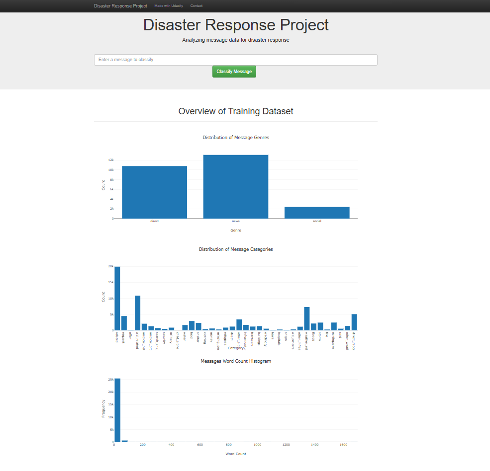
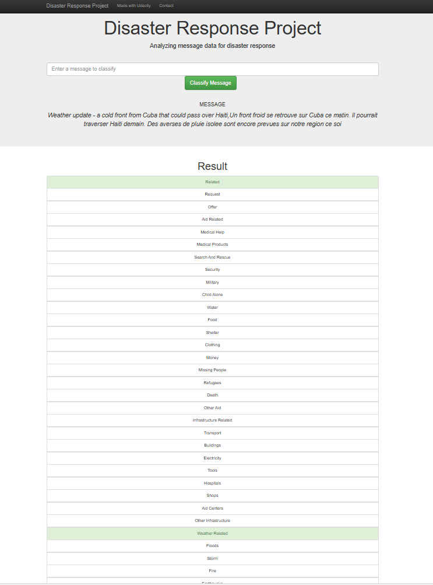

# Disaster Response Pipeline Project

This project is designed to process and classify disaster response messages. It includes an ETL pipeline for cleaning and storing data, a machine learning pipeline for building a message classifier, and a web application for users to input messages and view classification results.

---

## Table of Contents
1. [Project Overview](#project-overview)
2. [Getting Started](#getting-started)
   - [Prerequisites](#prerequisites)
   - [Setup Instructions](#setup-instructions)
3. [File Structure](#file-structure)
4. [Usage](#usage)
5. [Web Application Preview](#web-application-preview)
6. [Contributing](#contributing)
7. [License](#license)

---

## Project Overview
The Disaster Response Pipeline Project processes disaster-related messages and classifies them into predefined categories. This tool can aid emergency response teams by quickly categorizing incoming messages to determine the most relevant resources or actions needed.

---

## Getting Started

### Prerequisites
Ensure you have Python 3.10 installed on your machine. Use `python --version` to confirm your Python version.

### Setup Instructions
1. **Create a virtual environment**:
   ```bash
   python -m venv venv
   venv\Scripts\activate  # On Windows
   ```
   Install the required dependencies:
   ```bash
   pip install -r requirements.txt
   ```

2. **Set up the ETL and ML pipelines**:
   - **Run the ETL pipeline** to clean and store data in the database:
     ```bash
     python data/process_data.py data/disaster_messages.csv data/disaster_categories.csv data/DisasterResponse.db
     ```
   - **Run the ML pipeline** to train and save the classifier:
     ```bash
     python models/train_classifier.py data/DisasterResponse.db models/classifier.pkl
     ```

3. **Run the web application**:
   - Navigate to the `app` directory:
     ```bash
     cd app
     ```
   - Start the web application:
     ```bash
     python run.py
     ```

4. Open the homepage by clicking the **PREVIEW** button (or navigate to the specified URL in your terminal).

---

## File Structure
```
Disaster_Response_Pipeline/
│
├── app/
│   ├── templates/
│   │   ├── master.html
│   │   ├── go.html
│   ├── run.py
│
├── data/
│   ├── disaster_messages.csv
│   ├── disaster_categories.csv
│   ├── DisasterResponse.db
│   ├── process_data.py
│
├── models/
│   ├── train_classifier.py
│   ├── classifier.pkl
│
├── requirements.txt
├── README.md
```

---

## Usage
After running the ETL and ML pipelines, navigate to the web application to:
- Input a disaster-related message.
- View the predicted category of the message (e.g., "Search and Rescue," "Medical Help").

---

## Web Application Preview
### Homepage


### Message Classification Example


---

## Contributing
Contributions are welcome! Please fork the repository and submit a pull request for any improvements.

---

## License
This project is licensed under the MIT License. See the LICENSE file for details.
