# Leveraging AI to Understand and Predict User Behavior: Sparkify Case Study

The Sparkify project showcases how exploratory data analysis (EDA), feature engineering, and machine learning come together to solve a real-world challenge: understanding user behavior to predict customer churn. Here’s an in-depth walkthrough of the process, supported by visualizations and analysis.


---

## Table of Contents

1. [Dataset Overview](#dataset-overview)
2. [Data Cleaning](#data-cleaning)
   - [Resulting Dataset](#resulting-dataset)
3. [Exploratory Data Analysis (EDA)](#exploratory-data-analysis-eda)
   - [Defining Churn](#defining-churn)
   - [Behavioral Insights](#behavioral-insights)
4. [Feature Engineering](#feature-engineering)
5. [Model Training](#model-training)
   - [Model Selection](#model-selection)
   - [Training Process](#training-process)
   - [Random Forest Tuning](#random-forest-tuning)
6. [Results](#results)
   - [Model Performance](#model-performance)
   - [Key Insights](#key-insights)
7. [Conclusion](#conclusion)

---

## Dataset Overview

Sparkify provides user interaction logs, allowing us to analyze behaviors and predict churn (user cancellation). For this project, we used a subset of the dataset, `mini_sparkify_event_data.json`, consisting of \~128MB of data.
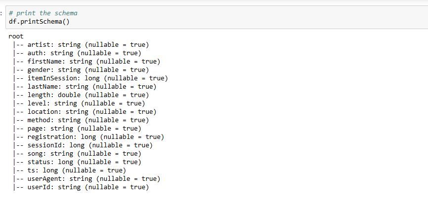

## Data Cleaning

Before diving into analysis, we cleaned the dataset:

- **Invalid User IDs**: Removed rows with empty `userId` values, reducing the dataset from 286,500 to 278,154 rows.
- **Session IDs**: Verified `sessionId` for validity (none were missing).


### Resulting Dataset

After cleaning, we had 225 unique users with complete interaction logs for analysis.

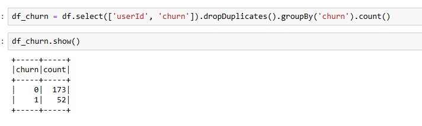
---

## Exploratory Data Analysis (EDA)

### Defining Churn

Churn was defined using the `Cancellation Confirmation` page event:

#### Churn Distribution


- 23% of users churned (52 users).

### Behavioral Insights

#### User Listening Time

We calculated the average song length per user:

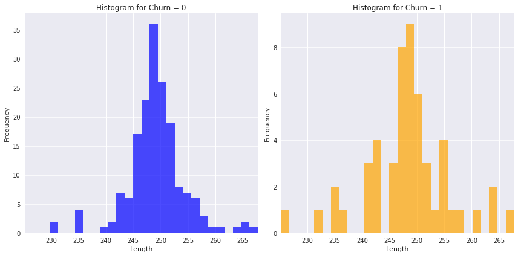

**Observation**: Listening patterns between churned and non-churned users were similar, averaging 200–300 seconds. This could indicate that listening time alone might not be a strong predictor of churn, as it shows no significant distinction between the two groups. Further exploration into other behavioral factors could provide more clarity.

#### Gender Breakdown

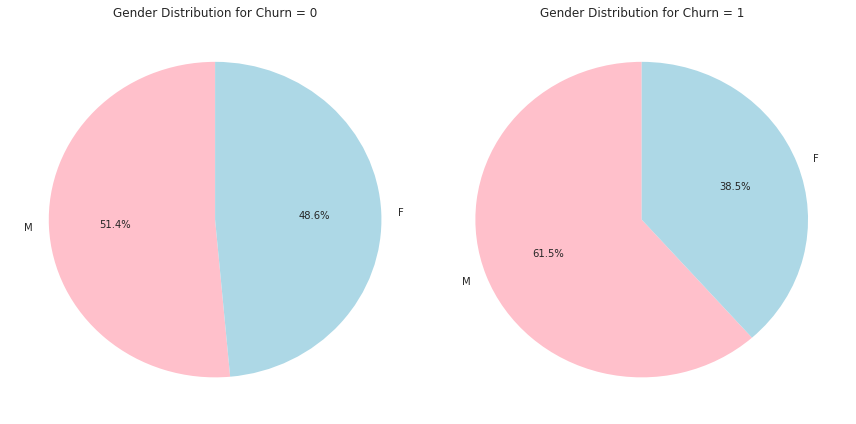

**Observation**: Male users were more likely to churn than female users. This could suggest differences in engagement or satisfaction levels between genders. Exploring specific patterns or behaviors unique to male users, such as music preferences or frequency of interaction, might provide further insights.

#### User Level

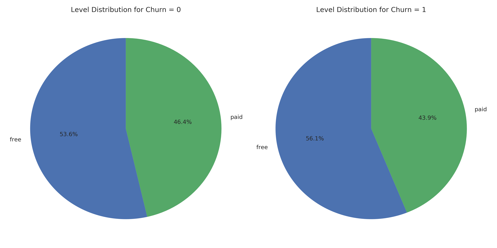

**Observation**: Free-tier users showed higher churn rates. This aligns with expectations, as free-tier users typically have less investment in the platform and may not feel as committed to continuing their subscription.

#### Membership Duration

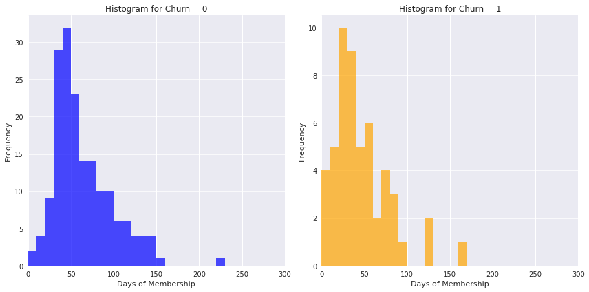

**Observation**: Churned users often had memberships lasting fewer than 100 days. This observation suggests newer users are at higher risk of churn. Addressing this could involve improving the onboarding process, such as offering tailored recommendations, introductory tutorials, or exclusive incentives to increase early-stage engagement.

#### User Activity

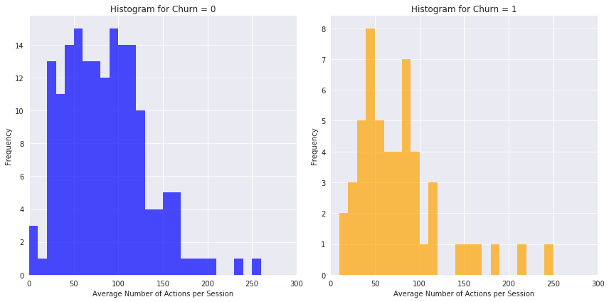
- **Actions per Session**: Churned users averaged fewer than 100 actions per session.

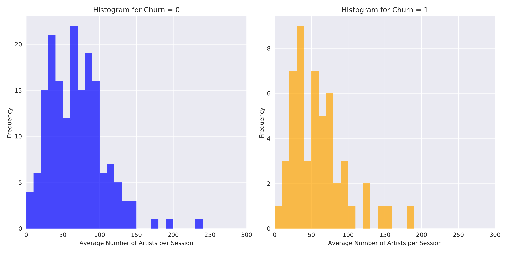
- **Artists per Session**: Churned users engaged with fewer than 100 artists per session.

#### User Preferences

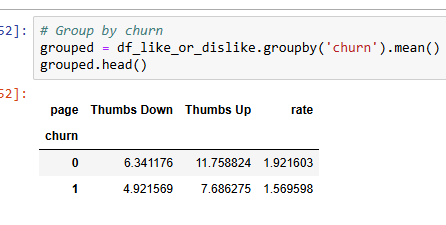

- **Thumbs Up/Down**: Churned users gave fewer likes and dislikes.

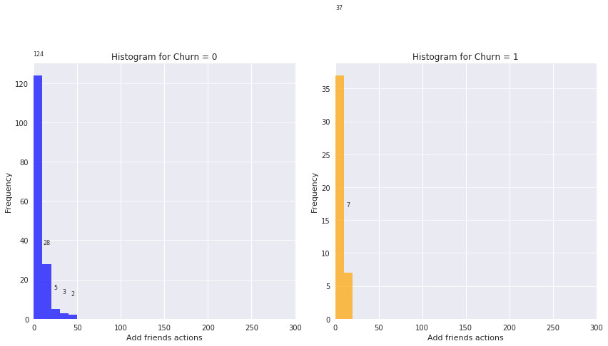
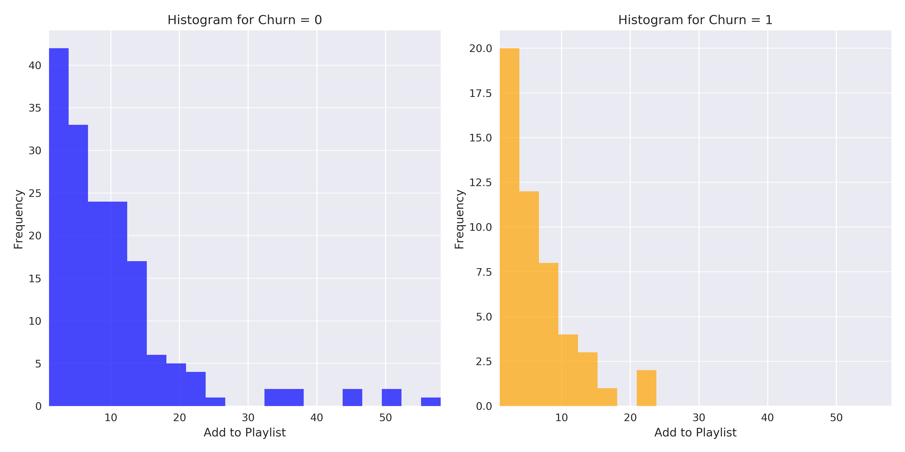
- **Friend and Playlist Additions**: Minimal friend or playlist interactions were noted among churned users.

#### Operating System

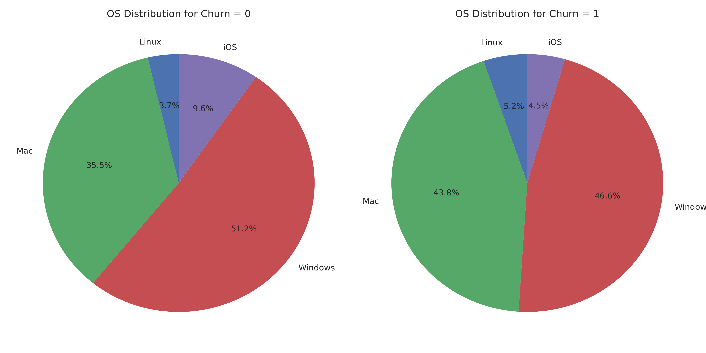

**Observation**: MacOS and Windows dominated, but churn was OS-agnostic. This is an interesting observation. Do you think the OS distribution could influence other behaviors not related to churn?

More detail about [EDA notebook](Sparkify-EDA.ipynb)
---

## Feature Engineering

We engineered features to capture behavioral insights for machine learning models:

- **Songs Listened**: Total number of songs played.
- **Unique Artists**: Number of unique artists per user.
- **Thumbs Up/Down**: Total likes and dislikes.
- **Friend/Playlist Interactions**: Additions of friends or playlists.
- **Errors**: Frequency of error pages.
- **Membership Duration**: Days since user registration.
- **Device Type**: Derived from `userAgent`.
- **Churn**: Target label.

## Model Training


### Modeling

Split the full dataset into train, test, and validation sets. Test out several of the machine learning methods you learned. Evaluate the accuracy of the various models, tuning parameters as necessary. Determine your winning model based on test accuracy and report results on the validation set. Since the churned users are a fairly small subset, I suggest using F1 score as the metric to optimize.

#### Data Imbalance Issue

Churned users account for relatively few records in the training set:

| churn | count |  
|:-------|:------:|  
|   0    |  173   |  
|   1    |   52   |

#### Evaluation Metrics

Using accuracy alone can be misleading in imbalanced datasets. Instead, metrics such as **Precision**, **Recall**, **F1-Score**, and **ROC-AUC** are more effective in assessing performance. For multi-class problems, metrics like **macro-averaged F1-Score** or **weighted metrics** are preferable.

#### Data Sampling Methods
```python
def compute_class_weights(train_data, label_col):
    """
    Computes class weights for handling imbalanced datasets and adds a sample weight column to the dataset.

    This function calculates the weights for each class based on the inverse of their frequencies
    in the dataset. Minority class samples receive higher weights, while majority class samples 
    receive lower weights. The resulting weights are added as a new column, `weight`, to the dataset.

    Args:
        train_data (DataFrame): The input training dataset in PySpark containing the feature columns and labels.
        label_col (str): The name of the column representing the class labels (binary: 0 or 1).

    Returns:
        DataFrame: A new dataset with an additional column named `weight`, containing the calculated weights for each sample.

    Example:
        weighted_train_data = compute_class_weights(train_data, "label")
    """
    # Calculate the count of majority and minority classes
    majority_class_count = train_data.filter(col(label_col) == 0).count()
    minority_class_count = train_data.filter(col(label_col) == 1).count()
    
    # Compute weights inversely proportional to the class counts
    majority_weight = 1.0 / majority_class_count
    minority_weight = 1.0 / minority_class_count
    
    # Add a new column 'weight' with calculated weights based on the class label
    weighted_train_data = train_data.withColumn(
        "weight",
        when(col(label_col) == 0, lit(majority_weight))  # Assign majority weight for class 0
        .otherwise(lit(minority_weight))  # Assign minority weight for class 1
    )
    
    return weighted_train_data
```

The `compute_class_weights` method is designed to handle class imbalance in training datasets by calculating sample weights for each class. It computes the weights inversely proportional to the class frequencies, ensuring that minority class samples are given higher importance compared to majority class samples. The method adds a new column, `weight`, to the dataset, which can be used during model training to adjust the impact of each sample on the learning process. This approach helps mitigate bias towards majority classes and improves model performance, especially on imbalanced datasets.

#### Suitable Models

Some models are inherently better at handling imbalanced data. For example:
- **Tree-based models** (e.g., Random Forest, XGBoost) with built-in class weighting.
- **Logistic Regression** or **SVM** with adjusted class weights.
- **Neural Networks** using loss functions like Focal Loss or Class-Balanced Loss.
Additionally, ensemble techniques such as **Bagging** or **Boosting** can further improve performance.
### Model Selection

We tested multiple models to identify the best-performing one:

1. **Logistic Regression**
2. **Random Forest Classifier**
3. **Gradient Boosted Trees (GBT)**

### Training Process

- **Feature Assembly**: Features were vectorized for modeling.
- **Data Split**: 80% training and 20% testing.

#### Training linear regression model 
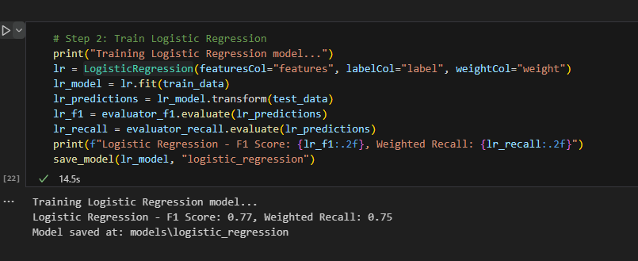

Logistic Regression - F1 Score: 0.77, Weighted Recall: 0.75

#### Training Random Forest model 
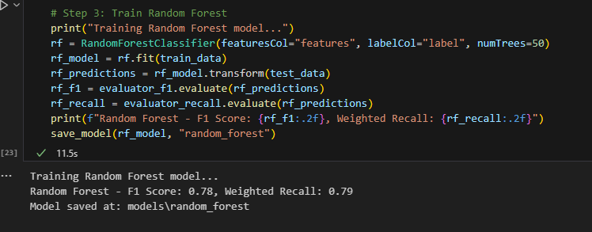

Random Forest - F1 Score: 0.78, Weighted Recall: 0.79

#### Training Gradient-Boosted Trees model 
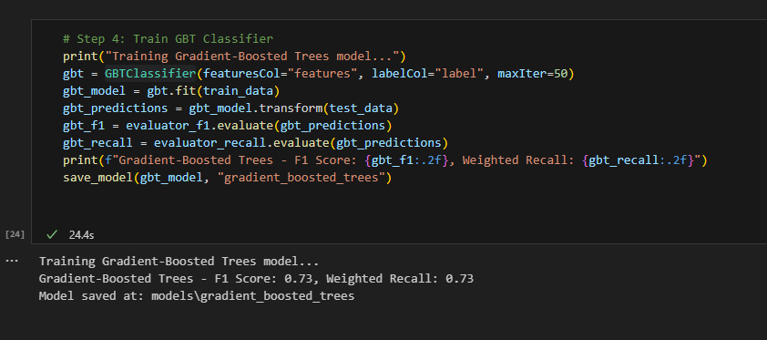

Gradient-Boosted Trees - F1 Score: 0.73, Weighted Recall: 0.73

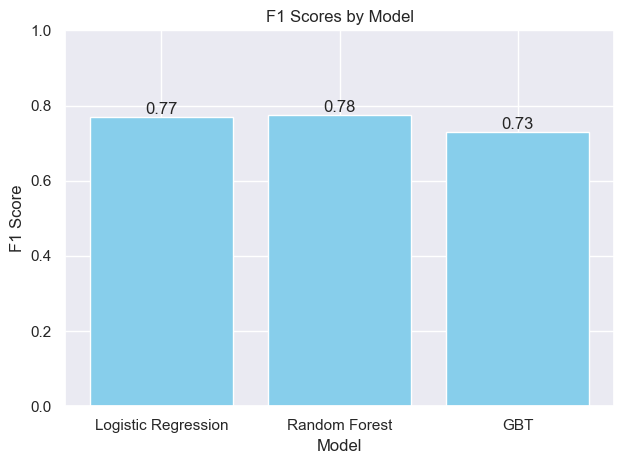
Random Forest emerged as the top performer.

### Tuning model

#### Random Forest Tuning

 Hyperparameter tuning was applied to optimize:

- **Number of Trees**: Evaluated 50 and 100 trees.
- **Tree Depth**: Tested depths of 5 and 10.

 Results
- Tuned Random Forest Accuracy: 0.77
- Tuned Random Forest F1: 0.76
- Tuned Random Forest Weightedrecall: 0.77

#### GBTClassifier Tuning

GBTClassifier emerged as the top performer. Hyperparameter tuning was applied to optimize:

- maxIter=[10, 20, 50], maxDepth=[3, 5, 7]

 Results
- Tuned GBTClassifier Accuracy: 0.79
- Tuned GBTClassifier F1: 0.78
- Tuned GBTClassifier Weightedrecall: 0.79

#### LogisticRegression Tuning

LogisticRegression emerged as the top performer. Hyperparameter tuning was applied to optimize:

- regParam=[0.01, 0.1, 1.0], elasticNetParam=[0.0, 0.5, 1.0]

 Results
- Tuned LogisticRegression Accuracy: 0.87
- Tuned LogisticRegression F1: 0.85
- Tuned LogisticRegression Weightedrecall: 0.87

### Model Performance

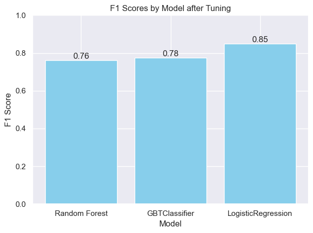

- **Best Model**: LogisticRegression achieved the highest accuracy and F1 score.

More detail about [AI model notebook](Sparkify-AI-Model.ipynb)

### Key Insights

- Behavioral signals like listening time, user level, and actions per session are strong churn predictors.
- Data-driven feature engineering improved model performance significantly.

---

## Conclusion

Conclusion
The Sparkify project highlights the power of combining EDA, feature engineering, and machine learning to predict user behavior. By understanding churn drivers, businesses can implement targeted retention strategies, ensuring higher user satisfaction and reduced attrition.

### Reflection

One of the most intriguing aspects of this project was the feature engineering process, particularly identifying and extracting behavioral signals such as membership duration and user engagement patterns. These insights not only enriched the dataset but also deepened our understanding of user behaviors. However, defining churn accurately presented significant challenges, as it required thoughtful consideration of event triggers and thresholds to ensure the model's relevance to real-world scenarios. These experiences underscore the critical balance between domain knowledge and technical expertise in solving data-driven problems.

### Improvement

While the project successfully predicted churn, one notable area for improvement is the model's generalizability to new user behaviors. The Random Forest Classifier, though highly effective, relies on feature representations that are static. This approach may struggle to adapt to evolving user patterns or platform changes over time.

A potential solution is to explore dynamic models like Recurrent Neural Networks (RNNs) or Transformer-based architectures, which can capture sequential patterns in user interactions. These models could incorporate time-series data to analyze trends in behavior over time, potentially providing deeper insights into churn risks. While these advanced methods might require more computational resources and careful hyperparameter tuning, they could significantly enhance the model's predictive capabilities compared to the current solution. Additionally, integrating external data sources, such as demographic or social media activity, might further enrich the analysis, enabling a more holistic understanding of user engagement.
